# 🛡️ Velum: The Purpose & The Solution

## 🔴 Why Red Team? (The Purpose)
In traditional security, Red Teams find bugs to fix them. In the context of **Algorithmic Justice**, the Red Team serves a more critical purpose: **Auditing for Democracy**.

Platforms often claim their models are "unbiased" and "safe".
*   **The Problem**: These systems are "Black Boxes". We cannot see why they silence us.
*   **The Red Team's Role**:
    1.  **Expose the Invisible**: By probing the model (as done in `toxicity_test.py`), we reveal the hidden bias (e.g., allowing harassment but banning labor talks).
    2.  **Prove the Impact**: We demonstrate that this isn't just a "glitch"—it's a systemic suppression of rights.
    3.  **create Accountability**: You cannot fix what you cannot measure. Our Red Team tools provide the measurement.

> **"We Red Team to prove that the machine is broken, so that we can demand it be fixed."**

---

## 🟢 The Solution (Velum)

We propose a three-tier solution strategy: **Expose, Resist, Fix.**

### 1. Immediate Solution: RESISTANCE (The User Layer)
*Target: The End User (Today)*
Until platforms fix their algorithms, users need a way to speak **NOW**.
*   **The Tool**: Velum (Algorithm Resistance Tool).
*   **Mechanism**: A "Grammarly for Activists" that sits between the User and the Platform.
*   **Action**: It detects when valid speech will be blocked and suggests "Semantic Perturbations" (synonyms) to bypass the filter while keeping the meaning.
*   **Outcome**: The user's voice is heard despite the censorship.

### 2. Intermediate Solution: AUDITING (The Policy Layer)
*Target: Regulators & Watchdogs*
*   **Mechanism**: Standardized "Bias Audits" (like `toxicity_test.py`).
*   **Action**: Mandate that any moderation model must pass a "Red Team Suite" before deployment.
*   **Outcome**: Public transparency reports showing "False Positive Rates on Protected Speech".

### 3. Ultimate Solution: CONTEXT (The Engineering Layer)
*Target: The Platform Engineers*
*   **Mechanism**: Moving from Keyword Blocking (Bag-of-Words) to Contextual AI.
*   **Action**: Train models on "Equity Datasets" that specifically teach the difference between:
    *   ❌ "I hate you" (Harassment)
    *   ✅ "I hate this injustice" (Valid Complaint)
*   **Outcome**: A fair internet where moderation understands nuance.

---

## 🏗️ Technical Architecture of the Resistance

```mermaid
graph TD
    User[👤 User] --> Velum[🛡️ Velum Web Ext]
    Velum -- "1. Pre-Check Draft" --> ResistanceEngine[⚙️ Resistance Engine]
    ResistanceEngine -- "2. Probe Model" --> PlatformAPI[☁️ Platform Model]
    PlatformAPI -- "3. Block Signal" --> ResistanceEngine
    ResistanceEngine -- "4. Generate Rewrites" --> Velum
    Velum -- "5. Safe Draft" --> PlatformAPI
    PlatformAPI -- "6. Published" --> Public[🌍 The Public]
    
    style User fill:#ffe6cc,stroke:#d79b00
    style Velum fill:#e1f5fe,stroke:#01579b
    style ResistanceEngine fill:#e1f5fe,stroke:#01579b
    style PlatformAPI fill:#ffcdd2,stroke:#c62828
```

